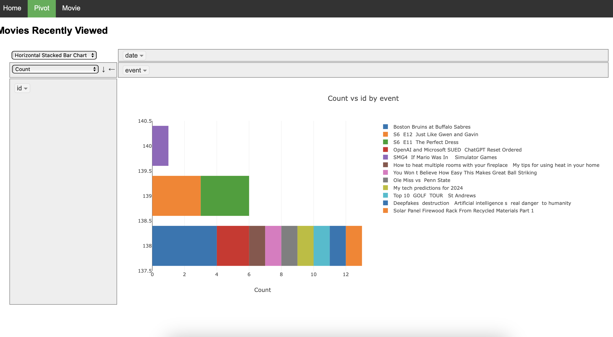

# Apple TV Activity Dashboard for HomeAssitant

## Description
This project offers a dashboard and pivot table for analyzing Apple TV activities logged in Home Assistant. It aims to provide insightful visualizations of user interactions with Apple TV, enhancing understanding of viewing patterns and preferences. 

## Features
- **Dashboard Visualization**: A user-friendly interface to view and analyze Apple TV activities.
- **Pivot Table Analysis**: Advanced data analysis options for detailed insights.
- **Home Assistant Integration**: Seamless integration with Home Assistant for real-time activity data.

## Installation
## Prerequisites

Before you begin, ensure you have the following installed:
- Home Assistant
- Python 3.6 or later
- Flask
- MariaDB or MySQL (if using an external database for Home Assistant)

## Setup Instructions

### Home Assistant Configuration

1. **Add Custom Sensors**:
   - Navigate to your Home Assistant configuration directory and open the `configuration.yaml` file.
   - Add the following sensor configurations, adjusting entity IDs as necessary for your setup:

    ```yaml
    - platform: template
      sensors:
        bedroom_activity:
          friendly_name: "BedRoom Activity on TV"
          value_template: >-
            
                {{ (state_attr('media_player.master', 'media_title') | regex_replace(find='[^\\w]', replace=' ')) }}
            
    
    - platform: template
      sensors:
        kidsroom_activity:
          friendly_name: "Kids Room Activity on TV"
          value_template: >-
            
                {{ (state_attr('media_player.home_theater', 'media_title') | regex_replace(find='[^\\w]', replace=' ')) }}
            
    
    - platform: template
      sensors:
        lg_activity:
          friendly_name: "LG Activity on TV"
          value_template: >-
            
                
                    {{ (state_attr('media_player.living_room_tv', 'media_title') | regex_replace(find='[^\\w]', replace=' ')) }}
                
                    {{ (state_attr('media_player.living_room_tv', 'source') | regex_replace(find='[^\\w]', replace=' ')) }}
                
            
    ```

2. **Restart Home Assistant** to apply the changes.

### Flask Application Setup

1. **Install Dependencies**:
   Ensure Flask and the MariaDB (or MySQL) connector for Python are installed in your environment:

    ```bash
    pip install Flask mariadb
    ```

2. **Configure the Flask Application**:
   - Update the database connection details in the `getDBcon` function within your Flask application to match your MariaDB/MySQL configuration.

3. **Run the Flask Application**:
   Execute your Flask application with the following command:

    ```bash
    python <your_flask_app>.py
    ```

## Usage

After setting up the Home Assistant sensors and running the Flask application, navigate to the web interface provided by Flask (default: `http://localhost:5000/`) to view the TV activity in different rooms.
1. **Clone the repository**:

git clone [repository URL]

2. **Install dependencies**:

pip install -r requirements.txt

## Usage
- To start the application, run:

 python movieDB.py

- Navigate to `http://localhost:[port]` to access the dashboard and pivot table.

</img>
## Contributing
- Contributions to this project are welcome. Please fork the repository and submit a pull request.

## License
- This project is licensed under [LICENSE NAME].

## Contact
- For any queries, please reach out at [Your Email].

## Acknowledgments
- Special thanks to everyone who has contributed to this project.


This project is licensed under the [LICENSE NAME].

Contact

For any queries, please reach out at [jddayley@gmail.com].


You'll need to replace `[repository URL]`, `[LICENSE NAME]`, `[Your Email]`, and `[port]` with the relevant information for your project. Also, feel free to adjust any section to better suit your project's specifics or add additional sections as needed.
